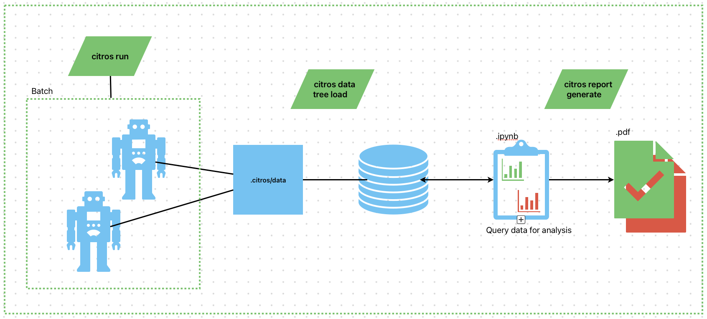

# WHAT IS `CITROS`

As described int the overview, `CITROS` is a platform that offers a wide range of tools to help you develop and test your ROS2 projects.
Here we will go over all the citros components and see how they work together to provide a seamless experience for the user.

## Components
- ROS2 project
  - We will use the `citros` cli to run the project
  - When you run `citros init` command, citros will extract all the ROS2 components for future use and create a `.citros` directory in your project root directory. the [`.citros`](../advanced_guides/citros_structure.md) directory will be initiated with defaults so that you can stat right away. 
  - when you run your ros2 project with citros, citros will record all the data from all the topics and dave it to the `.citros/data` directory for future use. 
- [.citros foder](../advanced_guides/citros_structure)
- DB
  - citros use portgres Db to load all the info into for fast query of the data for anakysis.
  - citros provides all the functionality to manage the DB if you dont want the hussle of setting up the DB yourself, just run `citros data db create` and you are good to go.
- [Data Analysis package](../data_analysis/)
- Report
  - After you have anaklysed your data with python notebook, you can generate a report with the `citros report` command.
  - The Python notebook is ray with pytest to generate a test report out of the notebook.
  - A pdf file is generated with the test report and the notebook.
  

## Flow Diagram
