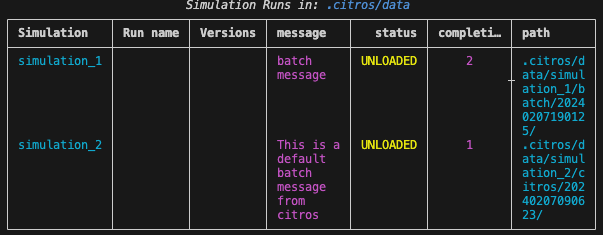

# `citros data list`

## Description

Shows a table of all batch runs in local `.citros/data` folder 

```bash
citros data list [-h] [-dir DIR] [-d] [-v]
```

Table Field|Description
|--|--|
|Simulation       |       The simulation name as shown under `.citros/simulations`|
|Run name       |       The given name for the batch|
|Version       |       The version of the batch run (if you run with same batch name new version created)|
|Message       |       The given message for this batch|
|Status       |       Status of the list in the DB. can be One of [`LOADED`, `UNLOADED`, `UNKNOWN`] values|
|Completions       |       The number of requested simulation completions runs for this batch|
|Path       |       The location of the batch

## Options
Option|Description
|--|--|
|-h, --help       |       Show this help message and exit|
|-dir DIR       |       The working dir of the project|
|-d, --debug       |       Set logging level to debug|
|-v, --verbose       |       Use verbose console prints|


## Examples

```bash
$ citros data list
```


## Interactive Mode

```bash
$ citros
```

```sh
? Select Action: 
┌────────────────────────────────────────────────────────────────────────────────────┐
│  Init: initialize .citros in current directory                                     │
│  Run: new simulation                                                               │
│❯ Data: for data management                                                         │
│  Report: generation and management                                                 │
│  ---------------                                                                   │
│  EXIT                                                                              │
└────────────────────────────────────────────────────────────────────────────────────┘
```

```sh
? Select Action: Data: for data management 
? Select Action: 
┌────────────────────────────────────────────────────────────────────────────────────┐
│  Tree view                                                                         │
│❯ List data                                                                         │
│  DB: section                                                                       │
│  ---------------                                                                   │
│  EXIT                                                                              │
└────────────────────────────────────────────────────────────────────────────────────┘
```
```sh
? Select Action: Data: for data management 
? Select Action: List data
                          Simulation Runs in: .citros/data                           
┌──────────────┬──────────┬──────────┬───────────┬──────────┬───────────┬────────────┐
│ Simulation   │ Run name │ Versions │ message   │   status │ completi… │ path       │
├──────────────┼──────────┼──────────┼───────────┼──────────┼───────────┼────────────┤
│ simulation_1 │          │          │ batch     │ UNLOADED │     2     │ .citros/d  │
│              │          │          │ message   │          │           │ ata/simul  │
│              │          │          │           │          │           │ ation_1/b  │
│              │          │          │           │          │           │ atch/2024  │
│              │          │          │           │          │           │ 020719012  │
│              │          │          │           │          │           │ 5/         │
│ simulation_2 │          │          │ This is a │ UNLOADED │     1     │ .citros/d  │
│              │          │          │ default   │          │           │ ata/simul  │
│              │          │          │ batch     │          │           │ ation_2/c  │
│              │          │          │ message   │          │           │ itros/202  │
│              │          │          │ from      │          │           │ 402070906  │
│              │          │          │ citros    │          │           │ 23/        │
└──────────────┴──────────┴──────────┴───────────┴──────────┴───────────┴────────────┘
```