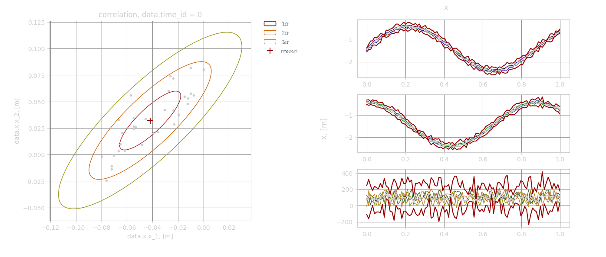

# Overview

This part of the **citros** package contains a range of analysis methods, including statistical analysis and regressions, enabling you to visualize the results and derive valuable insights from your data. It provides an easy way to establish a correspondence between the results of different simulations, examine the statistics in details, explore correlations, make predictions using regressions, and visualize the outcomes. See the [examples](getting_started_query_data.md) about the module usage, [documentation](../documentation/analysis/citros_data.md) of the main classes and [snippets](../snippets_doc/snippets_error_analysis.md).

