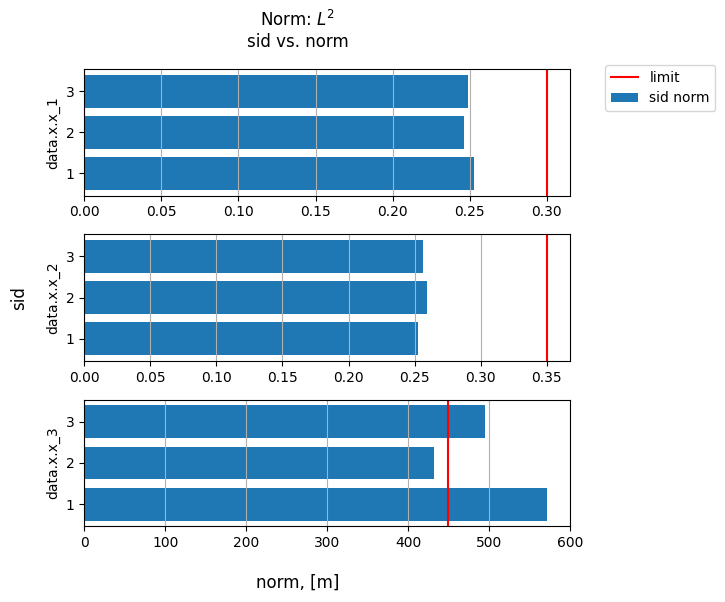

# Norm Test

[**norm_test()**](../documentation/validation/validation.md#validation.validation.Validation.norm_test) - test whether norm of the each simulation is less than the given limit.

Let's query data for a 3 dimensional vector, assign indexes to data to set correspondence between different simulations (see [Getting started](getting_started.md) page) and test whether the norm of each simulation is within the given limits:

```python
>>> df = citros.topic('A').data(['data.x.x_1', 'data.x.x_2', 'data.x.x_3', 'data.time'])
>>> V = va.Validation(df, data_label = ['data.x.x_1', 'data.x.x_2', 'data.x.x_3'], 
                      param_label = 'data.time', method = 'scale', num = 20, units = 'm')
                      
>>> log_norm, table, fig = V.norm_test(norm_type = 'L2', limits = [0.3, 0.35, 450])
```
The type of the norm may be specified by `norm_type` parameter:

  - `norm_type` = 'L2' - Euclidean norm or $L^2$ norm, square root of the sum of the squares:
  $$
  \sqrt{\sum_{k=1}^{N} x_k^2}
  $$
  - `norm_type` = 'Linf' - absolute maximum:
  $$
  \max_k{|x_k|}
  $$


## Setting Limits

Limits may be set as:
  
  - if `limits` are set as a one value, for example `limits` = 1, then it will be considered as a limit for all columns;
  - `limits` may be set separately for each column, as in the example above: `limits` = [0.3, 0.35, 450] means that for the first column limit on the norm is 0.3, for the second one is 0.35 and for the last column 450. That way length of the `limits` must be equal to the number of columns.

## Returning Parameters

The method returns three parameters: 
- `log` : [**CitrosDict**](../documentation/access/citros_dict.md#access.citros_dict.CitrosDict) - dictionary with test result summary;

```mermaid
flowchart TD
  log_norm((log_norm)) --- init4("'test_param'") --> |initial \ntest parameters| init4_("{'limits': list}")
  
  log_norm--- col4("column label,
    str") -->|whether the test\n passed or failed| B4("{'passed': bool}")

  col4 --> |fraction\n of the simulations\n that pass the test| C4("`{'pass_rate': float}")

  col4 --- E4('norm_value') --> |"norm for each\n of the simulation\n{sid: value}"| E4a("{int: float}")

  col4 -->|"sid that\nfail the test\n"| D4("`{'failed':list}")
```

- `table` : [**pandas.DataFrame**](https://pandas.pydata.org/docs/reference/api/pandas.DataFrame.html) - table that specifies for each simulation whether the norm is less then the given limit (True) or not (False).

- `fig` : [**matplotlib.figure.Figure**](https://matplotlib.org/stable/api/figure_api.html#matplotlib.figure.Figure)

The output of the example above:

```python
>>> fig.show()
```


The norm, calculated for each simulation of the 'data.x.x_1' and 'data.x.x_2' columns are within the established limits, while norm for simulation 1 and 3 of the 'data.x.x_3' column exceed the limit.

```python
>>> print(table)
```
||data.x.x_1 |data.x.x_2 |data.x.x_3
|--|--|--|--
sid||||
1 |True |True |False
2 |True |True |True
3 |True |True |False

`log` can be accessed like a regular python dictionary and can be printed using the [**print()**](../documentation/access/citros_dict.md#access.citros_dict.CitrosDict.print) method to display it as a JSON object:

```python
>>> log.print()
```
```js
{
 'test_param': {
   'limits': [0.3, 0.35, 450]
 },
 'data.x.x_1': {
   'passed': True,
   'pass_rate': 1.0,
   'norm_value': {
     1: 0.253,
     2: 0.246,
     3: 0.249
   },
   'failed': []
 },
 'data.x.x_2': {
   'passed': True,
   'pass_rate': 1.0,
   'norm_value': {
     1: 0.252,
     2: 0.259,
     3: 0.256
   },
   'failed': []
 },
 'data.x.x_3': {
   'passed': False,
   'pass_rate': 0.333,
   'norm_value': {
     1: 571.5,
     2: 431.8,
     3: 495.0
   },
   'failed': [1, 3]
 }
}
```

`log` contains summary of the test result: 
  - initial test parameters:
  ```python
  >>> log['test_param'].print()
  ```
  ```js
  {
   'limits': [0.3, 0.35, 450]
  }
  ```

  - Information about the test results of each column, let's take a look at the 'data.x.x_1':
    - 'passed' - whether the test for the column was passed (True) or not (False):
      ```python
      >>> print(log['data.x.x_1']['passed'])
      ```
      ```js
      True
      ``` 
    - 'pass_rate' - fraction of the points that pass the test, 0 < 'pass_rate' < 1:
      ```python
      >>> print(log['data.x.x_1']['pass_rate'])
      ```
      ```js
      1.0
      ```
    - 'norm_value' - the calculated for each simulation norm:
      ```python
      >>> log['data.x.x_1']['norm_value'].print()
      ```
      ```js
      {
       1: 0.253,
       2: 0.246,
       3: 0.249
      }
      ```

    - 'failed' - list with sids that do not pass the test. Since column 'data.x.x_1' passed the test, log['data.x.x_1']['failed'] is an empty list:
      ```python
      >>> print(log['data.x.x_1']['failed'])
      ```
      ```js
      []
      ```
      whereas in case of simulations 1 and 3 norm of the column 'data.x.x_3' exceed the give limit:
      ```python
      >>> print(log['data.x.x_3']['failed'])
      ```
      ```js
      [1, 3]
      ```
