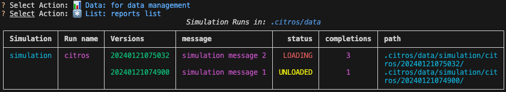
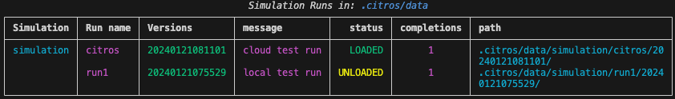

# Detailed Guide for CITROS

## Prerequisites for Working With CITROS

Download and install the following to work with CITROS

- [Python3](https://www.python.org/downloads/)
- [git](https://git-scm.com/)
- [Docker](https://docs.docker.com/get-docker/) - To understand why CITROS uses Docker, read [CITROS usage in Dockerfile](../guides/dockerfile_overview).

## Installation

To install CITROS using pip, open terminal and write the following command:

    $ pip install citros --upgrade

You can verify that the installation succeeded by running 

```bash
$ citros -V
```
:::tip
If you ran the `pip install citros` command and you still getting 
```bash
 $ citros: command not found
```
Try running:
```bash
 $ source ~/.profile 
```
This should solve your problem and you should be able to run citros commands, otherwise [contact us](https://discord.com/).
:::
## Clone CITROS Garden Project

All the projects can be found [here](https://github.com/orgs/citros-garden/repositories)

To clone the repository:
 ```sh
 git clone git@github.com:citros-garden/repository_name.git
   ```
## Run Project in VScode

### Open Project in VScode Dev Container

1. Open the cloned repository in VScode:

 ```sh
 cd ~/project-name
 code .
 ```
2. Open and run Docker.
3. Open the project in VScode.
4. Press on the bottom left corner icon.


5. Choose **Reopen in Container**


6. Open VScode terminal and make sure you are in the right location. <br />
 ```    
 ros@docker-desktop:/workspaces/[Project Name]$
 ```

7. [Build the project](#build-the-project)

### Build the project
 ```bash
 $ colcon build
 $ source install/local_setup.bash
 ```
## Initialization
```bash
$ citros init
Checking internet connection...
Checking ssh...
Updating Citros...
Waiting for repo to be ready...
Citros repo successfully cloned from remote.
Creating and checking out a new local branch `main` that will track the remote branch.
Default branch of remote 'origin' set to: main
Citros successfully synched with local project.
You may review your changes via `citros status` and commit them via `citros commit`.
Initialized Citros repository.
```
As you can see, a lot more is happening when you initialize your repository while being logged in. We will not delve into all the details behind the scenes, but as always, feel free to roam through the [CLI Documentation](https://citros.io/doc/docs_cli) for further details.

## Simulation
### Run Simulation
After your `.citros` repository has been initialized, you're ready to run a CITROS simulation.

1. type `citros` command
   ```bash
   $ citros
   ```

2. Choose the `Run` action:
   ```sh
   ? Select Action: 
   ┌────────────────────────────────────────────────────────┐
   │  🍋 Init: initialize .citros in current directory      │
   │❯ 🔥 Run: new simulation                                │
   │  📊 Data: for data management                          │
   │  📝 Report: generation and management                  │
   │  🔖 Service: CITROS API service functions              │
   │  ---------------                                       │
   │  EXIT                                                  │
   └────────────────────────────────────────────────────────┘
   ```

3. Name the batch run:
   ```sh
   ? Select Action: 🔥 Run: new simulation
   Please name this batch run (citros): 
   ```
   :::note
   Press `Enter` to name the simulation *"citros"*.
   :::


4. Enter a message for the batch:

   ```sh
   ? Select Action: 🔥 Run: new simulation
   Please name this batch run (citros): 
   Enter a message for this batch run (This is a default batch message from citros):
   ```
   :::note
   Press `Enter` to add the default batch run message:<br />
   *"This is a default batch message from citros"*
   :::

5. Choose number of runs:

   ```sh
   ? Select Action: 🔥 Run: new simulation
   Please name this batch run (citros): 
   Enter a message for this batch run (This is a default batch message from citros):
   How many times you want the simulation to run? (1):
   ```
   :::note
   Press `Enter` to run the simulation once
   :::


6. Lastly choose the simulation you want to run:
   ```sh
   ? Select Action: 🔥 Run: new simulation
   Please name this batch run (citros): 
   Enter a message for this batch run (This is a default batch message from citros):
   How many times you want the simulation to run? (1):
   ? Please choose the simulation you wish to run:
   ```

:::note
The command above will run the simulation on your machine, and save all the results under `.citros/data/[simulation_name]/[batch_name]/[date]` folder.<br /> 
The content of the [folder](../advanced_guides/citros_structure#directory-data) will contain: 
- recorded bags
- logs from the simulation and citros itself
- metadata about the run
- metrics and information about the system it was running 
- and more.
:::

To view all simulations use the data command:

```bash
$ citros
```

Choose the `Data` action:


```sh
? Select Action: 
┌────────────────────────────────────────────────────────┐
│  🍋 Init: initialize .citros in current directory      │
│  🔥 Run: new simulation                                │
│❯ 📊 Data: for data management                          │
│  📝 Report: generation and management                  │
│  🔖 Service: CITROS API service functions              │
│  ---------------                                       │
│  EXIT                                                  │
└────────────────────────────────────────────────────────┘
```

Choose `List` to view all simulations

```sh
? Select Action: 📊 Data: for data management 
? Select Action: 
┌────────────────────────────────────────────────────────┐
│  🌲 Tree: tree view of data                            │
│❯ *️⃣ List: reports list                                 │
│  📂 DB: section                                        │
│  🗳 Service: section                                   │
│  ---------------                                       │
│  EXIT                                                  │
└────────────────────────────────────────────────────────┘
```

Table of all the simulations will be shown as output. <br />
The table contains the following fields: Run name, Versions, message, status, completions, path



## CITROS DB

### Create DB
To create an instance of CITROS DB run
```bash
citros data db create
```

### Load Data to DB

1. To load the data

   ```bash
   $ citros
   ```

2. Choose the `Data` action:

   ```sh
   ? Select Action: 
   ┌────────────────────────────────────────────────────────┐
   │  🍋 Init: initialize .citros in current directory      │
   │  🔥 Run: new simulation                                │
   │❯ 📊 Data: for data managment                           │
   │  📝 Report: generation and management                  │
   │  🔖 Service: CITROS API service functions              │
   │  ---------------                                       │
   │  EXIT                                                  │
   └────────────────────────────────────────────────────────┘
   ```

3. choose the `Tree` action

   ```sh
   ? Select Action: 
   ┌────────────────────────────────────────────────────────┐
   │❯ 🌲 Tree: tree view of data                            │
   │  *️⃣ List: reports list                                 │
   │  📂 DB: section                                        │
   │  🗳 Service: section                                   │
   │  ---------------                                       │
   │  EXIT                                                  │
   └────────────────────────────────────────────────────────┘
   ```

4. Choose the simulation, batch and version you'ld like to upload:

   ```sh
   ? Select Action: 📊 Data: for data management 
   ? Select Action: 🌲 Tree: tree view of data
   ? Select Simulation: simulation_cannon_analytic
   ? Select Batch: citros
   ? Select Version: 20240103083547
   ```

5. Choose the `Load` actions
   ```sh
   ? Select Action: 📊 Data: for data management 
   ? Select Action: 🌲 Tree: tree view of data
   ? Select Simulation: simulation
   ? Select Batch: citros
   ? Select Version: 20240103083547
   ? Select Action: 
   ┌─────────────────────────────────────────────────────────────────┐
   │  Info                                                           │
   │❯ Load                                                           │
   │  Unload                                                         │
   │  Delete                                                         │
   │  ---------------                                                │
   │  EXIT                                                           │
   └─────────────────────────────────────────────────────────────────┘
   ```

:::note
You can [verify](#verify-data-loaded) the data is loaded before uploading it to the database
:::
### Verify Data Loaded
To verify the data is loaded
```bash 
citros data list
```

#### Batch Status
1. `LOADED` - the data is loaded to the database
2. `UNLOADED` - the data is loaded to the database



## Execute Notebook

CITROS provides a [citros data analysis package](https://pypi.org/project/citros-data-analysis/) that gives access and functionality to analyze the data.
We recommend to use this package with a `python notebook` which allows you to generate reports down the line.

:::note

citros data analysis package is installed while running `pip install citros`, so at this point you should have this package and you don't have to download it again.

:::

So now, after we uploaded the data, we can execute the notebook

2. Go to `notebooks` folder in your project.

3. Open [notebook_name].ipynb

4. Press `Run All` button

5. Scroll down the notebook to see the results.