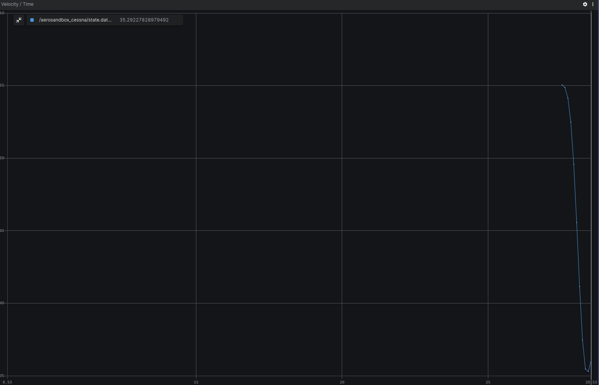
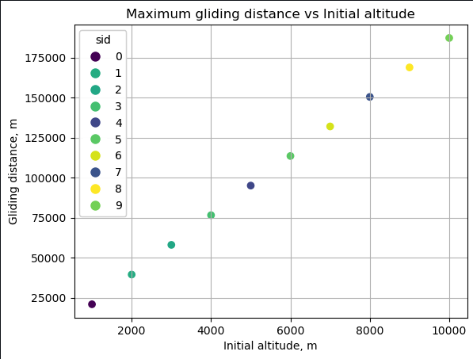

# Aerosandbox

## Overview
The project is a simulation tool developed using ROS 2 (Robot Operating System) nodes and leverages the Aerosandbox Python library for aerodynamic calculations. Its primary objective is to simulate gliding flight scenarios for a Cessna 152 aircraft in the event of engine failure.

You can find more information about this useful aerodynamics library on [Aerosandbox official website](https://github.com/peterdsharpe/AeroSandbox). All project installation, code overview and usage details are also available on the project's [GitHub page](https://github.com/citros-garden/aerosandbox_cessna).

.jpg")

## Prerequisites

1. Please make sure you have all the [necessary softwares](../../docs/guides/getting_started#prerequisites-for-working-with-citros) to work with CITROS installed on your computer.
2. Install [Visual Studio code](https://code.visualstudio.com/download).
3. We strongly recommend that you work with [dockers](../../docs/guides/dockerfile_overview). However, if you wish to work without dockers, please refer to the .devcontainer [directory](https://github.com/citros-garden/aerosandbox_cessna/tree/main/.devcontainer) in project's repo, the dependencies you need are in the ```Dockerfile``` file.
4. (Optional) Install [Foxglove](https://docs.Foxglove.dev/docs/introduction).


## Table of Contents
1. [Installation](#installation)
2. [Workspace Overview](#workspace-overview)
3. [CITROS Initialization](#citros-initialization)
4. [Scenario](#scenario)
5. [Running the Scenario Using CITROS](#running-the-scenario-using-citros)
6. [Results](#results)

## Installation
1. Clone the repository:

```bash
git clone git@github.com:citros-garden/aerosandbox_cessna.git
```

2. Open the repository in the [VScode Dev Container](../../docs/guides/getting_started#open-project-in-vscode-dev-container).

## Workspace Overview

The Aerosandbox simulation has the following ROS 2 parameters:

|Parameter	|Description	|Package
|--|--|--
h_0	|Initial altitude (m)	|aerosandbox_cessna		
v_0	|Initial velocity (knots)	|aerosandbox_cessna	
publish_freq	|Frequency of publishing	|aerosandbox_cessna	

This project contains only one launch file ```aerosandbox_cessna.launch.py```. This file will be used for CITROS launch. 

|Launch File	|Description	|Package
|--|--|--
aerosandbox_cessna.launch.py	|Aerosandbox simulation launch file  |aerosandbox_cessna


## CITROS Initialization

1. [Install CITROS](../../docs/guides/getting_started#installation).
2. [Initialize CITROS](../../docs/guides/getting_started#initialization).

## Scenario
For this tutorial, let's check how far the Cessna can glide with engine failure depending on initial altitude. To find it out, we need to set up parameters and launch CITROS simulation. <br/>
The user provides flight parameters as input parameters to configure the simulation. These parameters are essential for defining the initial conditions of the simulated flight.<br/>
The simulation takes into account various flight dynamics and aerodynamic factors to model the gliding behavior of the Cessna 152. The maximum gliding distance depends on plane's aerodynamic parameters, initial altitude and initial velocity.<br/>
We will be using [iPOPT](https://en.wikipedia.org/wiki/IPOPT#:~:text=IPOPT%2C%20short%20for%20%22Interior%20Point,the%20EPL%20(formerly%20CPL).) - optimal under the hood problem solver (iPOPT is also installed as part of the AeroSandbox package).<br/>
The parameter setup is listed in ```.citros/parameter_setups/default_param_setup.json```. <br/>
To find out how far the Cessna can glide with engine failure, we will examine the initial altitude, starting from 1000m and up to 10000m.
```json
{
    "packages": {
        "aerosandbox_cessna": {
            "aerosandbox_cessna": {
                "ros__parameters": {
                    "h_0": {
                        "function": "my_func.py:func_with_context",
                        "args": [1000.0]
                    },
                    "v_0": 107.0,
                    "publish_freq": 10.0
                }
            }
        }
    }
}
```

The ```my_func.py``` file should contain:
```python
def func_with_context(num, citros_context):
    return num + float(citros_context['run_id'])*1000
```

This function will set the ```h_0``` parameter in range from 1000 to 1000+1000*n, where n = number of runs.

Learn more about parameter setup and defining custom functions in [Directory parameter_setups](../../docs/advanced_guides/citros_structure#directory-simulations) and [Adding Functions to Parameter Setup](../../docs/guides/config_params) pages.

In addition to parameter setup, you can configure the simulation performance setup (timeout, CPU, GPU and Memory) as well.
This parameters can be found in ```.citros/simulations/simulation_aerosandbox_cessna.json```. <br/>
The default setup is 180 seconds timeout, 4 CPU, 4 GPU and 4096 MB of Memory.

Look in [Directory simulations page](../../docs/advanced_guides/citros_structure#directory-simulations) for more information.

## Running the Scenario Using CITROS

Follow these steps to [Run Simulation](../../docs/guides/getting_started#run-simulation):
1. Name your  batch run simulation: `aerosandbox_cessna`
2. Add a message to your batch run simulation: `local test run`
3. Run your simulation once.

All the results will be saved under `.citros/data/simulation_aerosandbox_cessna` folder.

To plot the local run results you can use [Foxglove](../../docs/guides/foxglove_visual) with the layout file existing in `foxglove_layout` folder.




## Results

1. [Create Database](../../docs/guides/getting_started#create-db)
2. [Upload data to the database](../../docs/guides/getting_started#load-data-to-db)
3. [Verify the data was loaded](../../docs/guides/getting_started#verify-data-loaded)
4. [Execute the Notebook](../../docs/guides/getting_started#execute-notebook) `aerosandbox_notebook_example.ipynb`. <br/>
You will find the notebook under `citros_template/notebooks` folder.



