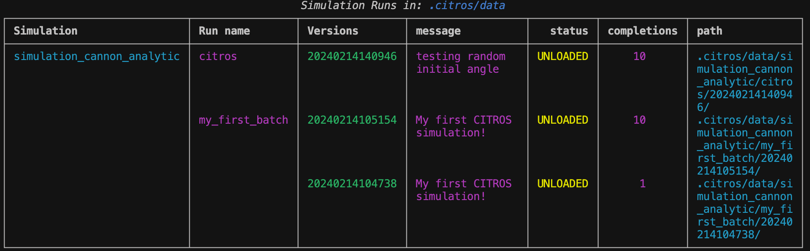
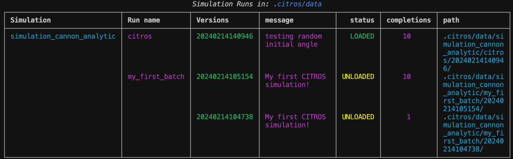

<!-- 
```mdx-code-block
import DocCardList from '@theme/DocCardList';

<DocCardList />
``` -->

# Introduction to CITROS

This tutorial will guide you through the CITROS CLI interface, using a simple ROS 2 example project to demonstrate the usage, while providing useful recommendations and best practices. While this is not a comprehensive guide to all CITROS CLI commands, it should get you up and running using your own projects with CITROS in no time. For further details and an exhaustive guide to the CITROS CLI, refer to the [CLI Documentation](https://citros.io/doc/docs_cli).


## The Cannon Example Project Overview

This project is a ROS 2 implementation of the [cannonball simulation](https://nasa.github.io/trick/tutorial/ATutASimpleSim) provided by NASA Johnson Space Center as part of the tutorial for the 
[Trick Simulation Environment](https://nasa.github.io/trick/).

It determines the trajectory and time of impact of a cannon ball that is fired with an initial speed and initial angle, assuming a constant acceleration of gravity (g), and no aerodynamic forces.


Two versions of the simulation are provided: an analytic solution and a numeric integration solution.

## Table of Contents

1. [Prerequisites](#prerequisites)
2. [Installation](#installation)
3. [Workspace Overview](#implementation-overview)
4. [Running the Solutions](#running-the-solutions)
5. [Visualization with Foxglove](#visualization-with-foxglove)
6. [Working with CITROS](#working-with-citros)
7. [CITROS Initialization](#citros-initialization)
8. [Simulations](#simulations)
9. [Data analysis](#data-analysis)
10. [Reports](#reports)

## Prerequisites

1. Install [Visual Studio code](https://code.visualstudio.com/download)
2. Install and Run [Docker](https://docs.docker.com/get-docker/)
3. Install [Foxglove](https://foxglove.dev/download) (optional)

## Installation

Open cmd on your desktop

1. Clone the project:

```bash
$ git clone git@github.com:citros-garden/cannon.git
```

2. Change to Cannon project directory:

```bash
$ cd ~/cannon
```

3. Open Cannon project in VScode:

```bash
$ code .
```
5. Re-open in Dev Container

    1. press on the bottom left corner icon.
     
     

    2. Choose **Reopen in Container**
     
     

6. Open VScode terminal and make sure you are in the right location
 
 ```    
 ros@docker-desktop:/workspaces/cannon$ 
 ```

:::note
From this point, all the actions should be typed in VScode terminal.
:::

7. Build your project

 ```bash
 $ colcon build
 $ source install/local_setup.bash
 ```

## Workspace Overview
The project is made out of three ROS nodes - `cannon_analytic`, `cannon_numeric` and `scheduler`.<br/>The scheduler node is responsible for driving the simulation by publishing a `scheduler` topic at a given rate (say, 100Hz). The cannon nodes subscribe to this topic, and upon receiving it perform a single calculation step. The rate (`dt`) is a ROS parameter for the scheduler node, which means you may change its value in the `config/params.yaml` file, without the need to recompile. The two cannon nodes also have `params.yaml` files of their own, in which you can set the initial speed and angle, and also the time/integration delta (`dt`).<br/>
Additionally, the `scheduler` node subscribes to a `debug` topic, which, together with the provided Foxglove layout, facilitates a play/pause/step/resume functionality.<br/>
The output of the simulation, i.e. the topic containing the calculated results, is called `cannon/state` (in both analytic and numeric versions). It is a list of `float` of size 4, the layout being:
        
    [position_x, position_y, velocity_x, velocity_y]

The simulation will halt when `position_y` reaches zero (i.e. impact).

## Running the Solutions

The cannon project contains two launch files, one for each solution

1. To run the analytic solution

 ```bash
 $ ros2 launch scheduler cannon_analytic.launch.py
 ```

2. To run the numeric integration solution

 ```bash
 $ ros2 launch scheduler cannon_numeric.launch.py
 ```

:::note
Running either of the two simulations will result in the logger output being written to the console.
:::


## Visualization with Foxglove
To view a graphical representation of the simulation:
1. Open [Foxglove](https://foxglove.dev/) 
2. Press on Foxglove icon at the top right
3. Click View
4. Click "Import layout from file"

 

5. Choose `CITROS Cannon.json` from the cannon project directory

6. Open a new Connection

 

7. Choose Rosbridge and press the `Open` button
 
 

8. You now have a working connection to your simulation.

9. If your simulation has stopped running in the terminal, run one of the [solutions](#running-the-solutions) again.

Output example:


## Working with CITROS

Working with the CITROS CLI is pretty straight forward, since there are only two things you need to do - initialize your ROS2 project with CITROS, and run your project. Additionally, you may [configure your simulations](#configuring-a-simulation) to fit your needs, but if all you want to do is to run your project via CITROS with the default configuration, then only two commands are necessary.

## CITROS Initialization

### Installation

in the dev-container's terminal, run
    
```bash
$ pip install citros --upgrade
```

:::tip
If you ran the `pip install citros` command and you still getting 
```bash
 $ citros: command not found
```
Try running:
```bash
 $ source ~/.profile 
```
This should solve your problem and you should be able to run citros commands, otherwise [contact us](https://discord.com/).
:::


### Initialization

Alrighty then! You're now ready to run the first command - `init`, which will initialize your local CITROS repository:
```bash
$ citros init
```

This command creates a folder named `.citros` under your project directory.<br />
The `.citros` directory contains several files and folders that capture the state of your project and allow you to configure your simulations according to your needs. We will discuss some of them briefly later on. For a full and detailed description of the contents of the `.citros`  directory, refer to the [CITROS File Structure](../docs/advanced_guides/citros_structure).

## Simulations

### Running a Simulation

After your `.citros` repository has been initialized, you're ready to run a CITROS simulation, albeit with all the default configurations, by using the `run` command:

```bash
$ citros
```

Choose the `Run` action:

```sh
? Select Action: 
┌─────────────────────────────────────────────────────────────────────────────────────┐
│  Init: initialize .citros in current directory                                      │
│❯ Run: new simulation                                                                │
│  Data: for data management                                                          │
│  Report: generation and management                                                  │
│  ---------------                                                                    │
│  EXIT                                                                               │
└─────────────────────────────────────────────────────────────────────────────────────┘
```

Name the batch: `my_first_batch`

```sh
? Select Action: Run: new simulation
? Please name this batch run (citros): my_first_batch
```

Enter a message for the batch: `My first CITROS simulation!`

```sh
? Select Action: Run: new simulation
Please name this batch run (citros): my_first_batch
? Enter a message for this batch run (This is a default batch message from citros): My first CITROS simulation!
```

Choose number of runs: `1`

```sh
? Select Action: Run: new simulation
Please name this batch run (citros): my_first_batch
Enter a message for this batch run (This is a default batch message from citros): My first CITROS simulation!
? How many times you want the simulation to run? (1): 1
```

Lastly choose "simulation_cannon_analytic":
```sh
? Select Action: Run: new simulation
Please name this batch run (citros): my_first_batch
Enter a message for this batch run (This is a default batch message from citros): My first CITROS simulation!
How many times you want the simulation to run? (1): 1
? Please choose the simulation you wish to run: 
  simulation_cannon_numeric
❯ simulation_cannon_analytic
```


:::note

This command will run the simulation on your machine, and save all the results under `.citros/data/[simulation_name]/[batch_name]/[date]` folder.<br /> The content of the [folder](../docs/advanced_guides/citros_structure#directory-runs) will contain: 
- recorded bags
- logs from the simulation and citros itself
- metadata about the run
- metrics and information about the system it was running 
- and more.

:::

### Concept Overview

To fully understand what's going on, we need to familiarize ourselves with three concepts that are core to the way CITROS works:
- ## **[simulation](../docs/advanced_guides/citros_structure##directory-simulations)** 
    The simulation object is defining what you want to run and how. It is a set of the launch file (the what) and the parameter setup (the how) as well as the resources needed for it to run and after how much time it should be killed. 

    Defaults simulation files defined by a ROS 2 launch file. You may have as many launch files as you want in your project, as long as there is at least one. Each simulation will correspond to a launch file in your project. When you run a CITROS simulation, if you don't specify the name of the simulation (using the `-s` flag), a command-line menu will be presented, in which you can use the up and down arrows to choose the simulation you want. The simulation names will be of the form `simulation_<name of launch_file>`. In the case of the Cannon project, we have two launch files - `cannon_analytic.launch.py` and `cannon_numeric.launch.py`, and as you can see in the output above, we are prompted to choose between them. 

    Each simulation also corresponds to a json file of the same name, which resides under the [`.citros/simulations`](../docs/advanced_guides/citros_structure#directory-simulations) directory. You may use this file to configure the way your simulation runs. 

    When you run a CITROS simulation, a directory for that simulation is created under the [`.citros/data`](../docs/advanced_guides/citros_structure#directory-data) directory. This directory will contain subdirectories corresponding to **batch**es, a new one created every time you run a simulation.

- ## **batch** 

    Defined as a group of one or more simulation runs. Since you can specify one or more simulations runs ('*completions*') when running a CITROS simulation, a **batch** is simply a convenient way to group them together. For instance, in the case of the above example, if we choose `simulation_cannon_analytic` from the menu, the following folder structure will be created: `.citros/data/simulation_cannon_analytic/my_first_batch/20231231120623/0`. The last folder - `0`, is the folder corresponding to the only run for this batch. the name of each run is a zero based index, incremented by one for each additional run.

- ## **run**

    Defined as a single execution of a simulation as defined by the chosen launch file. <br />
    The folder corresponding to a simulation run will contain all the information relevant for that run. Look through such a folder after running a simulation and see for yourself.<br />For further details refer to the [.citros/data](../docs/advanced_guides/citros_structure#directory-data) directory.


By default, when using the `run` command, you must provide a batch name and a message. The name you provide will be used as the name of the directory in which all runs for this batch will be saved. If a batch by that name already exists - no worries, CITROS will simply add a new version under the simulation name you provided, thereby keeping the batch version unique for each simulation. 

Now that you understand what's going on, choose one of the simulations presented in the menu, press enter and see it runs...

### Configuring a Simulation

We just ran a simulation with all the default configurations, which is admittedly not that exciting. Let's see how we can turn things up a notch by setting up dynamic parameter evaluation for our simulation, thereby allowing each run within the same batch to have different parameter values.

The [`.citros/parameter_setups`](../docs/advanced_guides/citros_structure##directory-parameter_setups) directory stores your JSON-formatted parameter setup files. When you initialize your citros repository, a `default_param_setup.json` file is automatically generated. This file consolidates all the default parameters for every node across all the packages in your ROS project, providing a consolidated and easily accessible record of these parameters.

The structured format of the parameter setup files streamlines both the understanding and alteration of parameters for each node in your ROS project. This becomes especially valuable when you're keen to explore the influence of different parameter values on your ROS project's behavior.

In the Cannon project, we have a total of three nodes. Let's look at the parameters for the `analytic_dynamics` node in the `cannon_analytic` package, as defined in the `default_param_setup.json` file.
We can see we have 3 parameters to play around with - `init_speed`, `init_angle` and `dt`. 

```json
//[project]/.citros/parameter_setups/default_param_setup.json
{
    "packages": {
        "cannon_analytic": {
            "analytic_dynamics": {
                "ros__parameters": {
                    "init_speed": 50.0,
                    "init_angle": 30.0,
                    "dt": 0.01
                }
            }
        },
        ...
    }
}
```

Let's say we want to find out the optimal initial angle for the cannon, which will provide the maximum range. Assuming we're completely blanking out on high-school physics, let's randomize the value for this parameter, execute several simulation runs, and see where we get the maximum range. To achieve this, we can simply replace the hard-coded default value with a [**function object**](../docs/guides/config_params). Function objects are json objects comprised of two fields - `function` and `args`. They come in two flavors - numpy and user-defined. For our purposes we can use numpy's random module to generate a normal distribution around a given value:

    "init_angle": {
                    "function": "numpy.random.normal",
                    "args": [45, 15]
                },

This will cause a normal distribution with a standard deviation of 15 around 45 to be evaluated for every simulation run.

Another way to use the run command is writing the full command: 

```bash
citros run -n "citros" -m "testing random initial angle" -c 10
```

and choose `simulation_cannon_analytic` from the menu, the simulation will run 10 times, and each time the cannon will have a different initial angle. By looking at the [results](#results), we can hopefully come to the conclusion that 45 degrees is the optimal angle. 

### Review All Simulations Data

To view all simulations use the data command:

```bash
$ citros
```

Choose the `Data` action:


```sh
? Select Action: 
┌─────────────────────────────────────────────────────────────────────────────────────┐
│  Init: initialize .citros in current directory                                      │
│  Run: new simulation                                                                │
│❯ Data: for data management                                                          │
│  Report: generation and management                                                  │
│  ---------------                                                                    │
│  EXIT                                                                               │
└─────────────────────────────────────────────────────────────────────────────────────┘
```

Choose `List` to view all simulations

```sh
? Select Action: Data: for data management 
? Select Action: 
┌─────────────────────────────────────────────────────────────────────────────────────┐
│  Tree view                                                                          │
│❯ List data                                                                          │
│  DB: section                                                                        │
│  ---------------                                                                    │
│  EXIT                                                                               │
└─────────────────────────────────────────────────────────────────────────────────────┘
```
Table of all the simulations will be shown as output. <br />
The table contains the following fields: Run name, Versions, message, status, completions, path


## Data Analysis

After you've run a batch using CITROS, your data is stored under the `.citros/data` directory.
The data is accessible using all existing ROS2 tools (foxglove, grepROS, etc.). 

**CITROS approach** is first to upload the recorded data into a local PGDB (Postgress Database) instance allowing you to access the data, query and analyze it more efficiently than the traditional tools.

### CITROS DB

To create an instance of CITROS DB run
```bash
citros data db create
```

### Upload Data to DB

Make sure that the data you want to access is uploaded:

```bash 
citros data list
```

In the image below you can see that the status of the batch run is `UNLOADED`



To load the data

```bash
$ citros
```

Choose the `Data` action:

```sh
? Select Action: 
┌─────────────────────────────────────────────────────────────────────────────────────┐
│  Init: initialize .citros in current directory                                      │
│  Run: new simulation                                                                │
│❯ Data: for data management                                                          │
│  Report: generation and management                                                  │
│  ---------------                                                                    │
│  EXIT                                                                               │
└─────────────────────────────────────────────────────────────────────────────────────┘
```

choose the `Tree` action

```sh
? Select Action: Data: for data management 
? Select Action: 
┌─────────────────────────────────────────────────────────────────────────────────────┐
│❯ Tree view                                                                          │
│  List data                                                                          │
│  DB: section                                                                        │
│  ---------------                                                                    │
│  EXIT                                                                               │
└─────────────────────────────────────────────────────────────────────────────────────┘
```
Choose the simulation:

```sh
? Select Action: Data: for data management 
? Select Action: Tree view
? Select Simulation: 
┌─────────────────────────────────────────────────────────────────────────────────────┐
│❯ simulation_cannon_analytic                                                         │
└─────────────────────────────────────────────────────────────────────────────────────┘
```

Choose the batch:
```sh
? Select Action: Data: for data management 
? Select Action: Tree view
? Select Simulation: simulation_cannon_analytic
? Select Batch: 
┌─────────────────────────────────────────────────────────────────────────────────────┐
│  my_first_batch                                                                     │
│❯ citros                                                                             │
└─────────────────────────────────────────────────────────────────────────────────────┘
```

choose the version:
```sh
? Select Action: Data: for data management 
? Select Action: Tree view
? Select Simulation: simulation_cannon_analytic
? Select Batch: citros
? Select Version: 
┌─────────────────────────────────────────────────────────────────────────────────────┐
│❯ 20240214110927                                                                     │
└─────────────────────────────────────────────────────────────────────────────────────┘
```
Choose the `Load` actions
```sh
? Select Action: Data: for data management 
? Select Action: Tree view
? Select Simulation: simulation_cannon_analytic
? Select Batch: citros
? Select Version: 20240214110927
? Select Action: 
┌─────────────────────────────────────────────────────────────────────────────────────┐
│  Info                                                                               │
│❯ Load                                                                               │
│  Unload                                                                             │
│  Delete                                                                             │
│  ---------------                                                                    │
│  EXIT                                                                               │
└─────────────────────────────────────────────────────────────────────────────────────┘
```

To verify the data is loaded
```bash 
citros data list
```

In the image below you can see that the status of the batch run changed to `LOADED`


### Execute Notebook

CITROS provides a [citros data analysis package](https://pypi.org/project/citros-data-analysis/) that gives access and functionality to analyze the data.
We recommend to use this package with a `python notebook` which allows you to generate reports down the line.

:::note

citros data analysis package is installed while running `pip install citros`, so at this point you should have this package and you don't have to download it again.

:::

So now, after we uploaded the data, we can execute the notebook

2. Go to `notebooks` folder in your project.

3. Open data_analysis.ipynb

4. Press `Run All` button

5. Scroll down the notebook to see the results.

#### Results

here is a sample of the notebook execution:
```python
#import matplotlib
import matplotlib.pyplot as plt

#create a figure to plot on
fig, ax = plt.subplots()

citros.batch(-1).topic('/cannon/state').sid([0,1,2,3,4]).\
       time_plot(ax, var_name = 'data.data[1]', time_step = 0.01, y_label = 'y', title_text = 'y vs. t')
```


## Reports

Report is a combination of data and notebook generated into one immutable signed pdf. This is a great tool which can help you to track the metric of your project overtime.<br />For example, you can create a report that measures accuracy, this report can be generated each version so with time you can see the progress of the accuracy increases.

### Generate Report

For this tutorial we will show you how to generate a report from the [notebook above](#execute-notebook).

run citros command

```bash
$ citros
```

Choose the `Report` action:

```sh
? Select Action: 
┌─────────────────────────────────────────────────────────────────────────────────────┐
│  Init: initialize .citros in current directory                                      │
│  Run: new simulation                                                                │
│  Data: for data management                                                          │
│❯ Report: generation and management                                                  │
│  ---------------                                                                    │
│  EXIT                                                                               │
└─────────────────────────────────────────────────────────────────────────────────────┘
```

Choose `Generate` to generate a report

```sh
? Select Action: Report: generation and management
? Select Action: 
┌─────────────────────────────────────────────────────────────────────────────────────┐
│  List: reports list                                                                 │
│❯ Generate: new report                                                               │
│  ---------------                                                                    │
│  EXIT                                                                               │
└─────────────────────────────────────────────────────────────────────────────────────┘
```

Choose the simulation source for the report

```sh
? Select Action: Report: generation and management
? Select Action: Generate: new report
? Select Simulation: 
┌─────────────────────────────────────────────────────────────────────────────────────┐
│❯ simulation_cannon_analytic                                                         │
└─────────────────────────────────────────────────────────────────────────────────────┘
```

Select a batch from you batch list

```sh
? Select Action: Report: generation and management
? Select Action: Generate: new report
? Select Simulation: simulation_cannon_analytic
? Select Batch: 
┌─────────────────────────────────────────────────────────────────────────────────────┐
│  my_first_batch                                                                     │
│❯ citros                                                                             │
└─────────────────────────────────────────────────────────────────────────────────────┘
```

Select a version
```sh
? Select Action: Report: generation and management
? Select Action: Generate: new report
? Select Simulation: simulation_cannon_analytic
? Select Batch: citros
? Select Version: 
┌─────────────────────────────────────────────────────────────────────────────────────┐
│❯ 20240214113810                                                                     │
└─────────────────────────────────────────────────────────────────────────────────────┘
```

Name your report *(or press enter for "citros" as a default report name)*:
```sh
? Select Action: Report: generation and management
? Select Action: Generate: new report
? Select Simulation: simulation_cannon_analytic
? Select Batch: citros
? Select Version: 20240214113810
Please name this report (citros): My first report
```

Enter a message for the report (or press enter for "This is a default report message from citros" as a default report message):
```sh
? Select Action: Report: generation and management
? Select Action: Generate: new report
? Select Simulation: simulation_cannon_analytic
? Select Batch: citros
? Select Version: 20240214113810
Please name this report (citros): My first report
Enter a message for this report (This is a default report message from citros): Best report ever
```

choose the notebook for the report

```sh
? Select Action: Report: generation and management
? Select Action: Generate: new report
? Select Simulation: simulation_cannon_analytic
? Select Batch: citros
? Select Version: 20240214113810
Please name this report (citros): My first report
Enter a message for this report (This is a default report message from citros): Best report ever
? Select notebook: Use [space] to select notebooks, [enter] to confirm selection. 
┌─────────────────────────────────────────────────────────────────────────────────────┐
│❯ notebooks/data_analysis.ipynb                                                      │
└─────────────────────────────────────────────────────────────────────────────────────┘
```

### Reports List 

To view all created reports 

```bash 
citros report list
```


All the reports are under [`.citros/reports`](../docs/advanced_guides/citros_structure##directory-reports) directory.

:::note

The content of the `report` folder will contain 
- output of the python notebook
- Report info
- Generated pdf report

:::