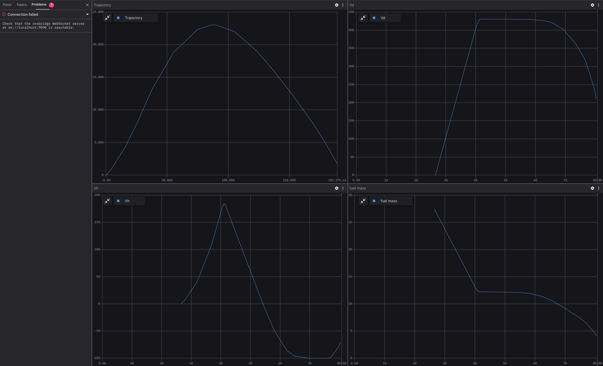
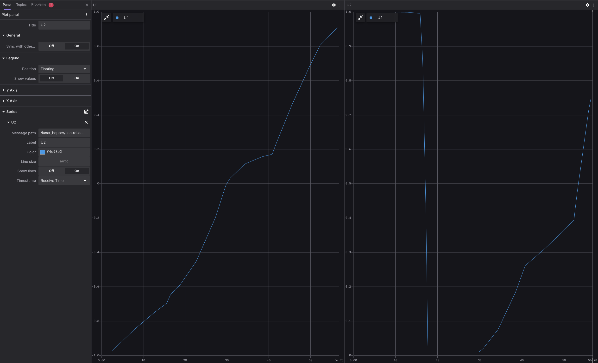
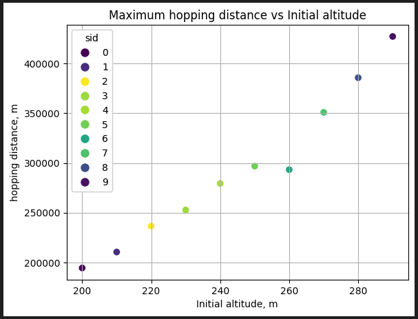

# Lunar Hopper

## Overview
The Lunar Hopper project is a lunar exploration planning project aimed at solving the intricate problem of lunar hopper missions. It focuses on optimizing the spacecraft's trajectory across the whole flight. Leveraging state-of-the-art optimal problem-solving algorithms, specifically the [MPOPT Python library](https://mpopt.readthedocs.io/en/latest/), this project seeks to determine the most efficient path for maximizing the distance traveled during the mission. It empowers users to customize essential parameters such as spacecraft mass, fuel quantity, thrust, and specific impulse. 

")

## Prerequisites

1. Please make sure you have all the [necessary softwares](../../docs/guides/getting_started#prerequisites-for-working-with-citros) to work with CITROS installed on your computer.
2. Install [Visual Studio code](https://code.visualstudio.com/download).
3. We strongly recommend that you work with [dockers](../../docs/guides/dockerfile_overview). However, if you wish to work without dockers, please refer to the .devcontainer [directory](https://github.com/citros-garden/aerosandbox_cessna/tree/main/.devcontainer) in project's repo, the dependencies you need are in the ```Dockerfile``` file.
4. (Optional) Install [Foxglove](https://docs.Foxglove.dev/docs/introduction).

## Table of Contents
1. [Installation](#installation)
2. [Workspace Overview](#workspace-overview)
3. [CITROS Initialization](#citros-initialization)
4. [Scenario](#scenario)
5. [Running the Scenario Using CITROS](#running-the-scenario-using-citros)
6. [Results](#results)

## Installation
1. Clone the repository:
```bash
git clone git@github.com:citros-garden/lunar_hopper.git
```

2. Open the repository in the [VScode Dev Container](../../docs/guides/getting_started#open-project-in-vscode-dev-container).

## Workspace Overview

The Lunar Hopper simulation has the following ROS 2 parameters:

|Parameter	|Description	|Package
|--|--|--
m_fuel_0	|Initial fuel mass date	|lunar_hopper	
m_fuel_f	|Final fuel mass	|lunar_hopper
dry_mass	|dry mass	|lunar_hopper
F_thrustmax	|The maximum amount of thrust	|lunar_hopper
Isp	|Specific impulse		|lunar_hopper	
publish_freq	|Frequency of publishing	|lunar_hopper

:::note
- Variables with '_0' are initial conditions.
- Variables with '_f' are final conditions.
:::

This project contains only one launch file which will be used for CITROS launch. 

|Launch File	|Description	|Package
|--|--|--
lunar_hopper.launch.py	|Lunar Hopper simulation launch file 	|lunar_hopper


## CITROS Initialization

1. [Install CITROS](../../docs/guides/getting_started#installation).
2. [Initialize CITROS](../../docs/guides/getting_started#initialization).

## Scenario
The optimal trajectory computes by solving non-linear OCP (optimal control problems) in the standard Bolza form, by using pseudo-spectral collocation methods and adjusted, using an additional real dynamic function. <br/> 
The OCP solver used in this example is [MPOPT](https://mpopt.readthedocs.io/en/latest/) (based on [IPOPT](https://en.wikipedia.org/wiki/IPOPT#:~:text=IPOPT%2C%20short%20for%20%22Interior%20Point,the%20EPL%20(formerly%20CPL).)) library modified by Lulav Space team. <br />
The main goal of the project is to find the optimal way to "hop" on the Moon as far as possible with given vessel parameters.<br/>

For this tutorial, let's check how far the Hopper can hop on the Moon depending on Specific Impulse.
For that, we will launch a simulation batch with a distribution of Specific impulse parameter, starting from 200 and up to 300.
The parameter setup is listed in ```.citros/parameter_setups/default_param_setup.json```. <br/>

```json
{
    "packages": {
        "lunar_hopper": {
            "lunar_hopper": {
                "ros__parameters": {
                    "m_fuel_0": 27.5,
                    "m_fuel_f": 0.0,
                    "dry_mass": 30.0,
                    "Fthrustmax": 208.0,
                    "Isp": {
                        "function": "my_func.py:func_with_context",
                        "args": [200]
                    },
                    "publish_freq": 10.0
                }
            }
        }
    }
}
```

The ```my_func.py``` file should contain:
```python
def func_with_context(num, context):
    return num + float(context['sid'])*10
```

This function will set the ```Isp``` parameter in range from 200 to 200+10*n, where n = number of runs.

Learn more about parameter setup and defining custom functions in [Directory parameter_setups](../../docs/advanced_guides/citros_structure#directory-simulations) and [Adding Functions to Parameter Setup](../../docs/guides/config_params) pages.

In addition to parameter setup, you can configure the simulation performance setup (timeout, CPU, GPU and Memory) as well.
These parameters can be found in ```.citros/simulations/simulation_lunar_hopper.json```. <br/>
Look in [Directory simulations page](../../docs/advanced_guides/citros_structure#directory-simulations) for more information.

## Running the Scenario Using CITROS

Follow these steps to [Run Simulation](../../docs/guides/getting_started#run-simulation):
1. Name your  batch run simulation: `Lunar_hopper`
2. Add a message to your batch run simulation: `local test run`
3. Run your simulation once.

All the results will be saved under `.citros/data/simulation_lunar_hopper` folder.

To plot the local run results you can use [Foxglove](https://citros.io/doc/docs_tutorials/#visualization-with-Foxglove).

Use ```layout_states.json``` for states plots:



Use ```layout_controls.json``` for controls plots:




## Results

1. [Create Database](../../docs/guides/getting_started#create-db)
2. [Upload data to the database](../../docs/guides/getting_started#load-data-to-db)
3. [Verify the data was loaded](../../docs/guides/getting_started#verify-data-loaded)
4. [Execute the Notebook](../../docs/guides/getting_started#execute-notebook) `aerosandbox_notebook_example.ipynb`. <br/>
You will find the notebook under `citros_template/notebooks` folder.



