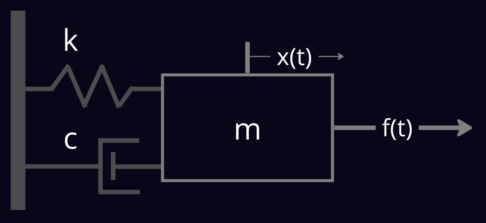

# Mass Spring Damper

## Overview

This is a simple ROS demonstration of a mass-spring-damper system.



The example contains two ROS 2 packages: `dynamics` and `controller`.

### System Dynamics

The system's equations of motion:

$$
        m\ddot x =  kf(t) -c\dot x -kx
$$

and after laplace transformation (with zero I.C) we get a second order system:

$$
        {X \over F} = {\omega_n^2 \over s^2 +2\omega_n\zeta s + \omega_n^2}
$$

where the natural frequency $\omega_n = \sqrt{k \over m}$

You can choose the system's parameters `m`, `k` and `c` and choose the initial condition `x0`, `v0` and `a0`, all configured as ROS 2 parameters.  

### The Controller

You can write your own controller to try stabilize the system for a given setpoint.

the default controller is a simple PID controller with the following form:

$$
        f(t) = {k_pe(t) + k_i\int{e(t)dt}} + k_d {d\over dt}(e(t))
$$

you can tune the controller gains, $k_p$, $k_i$, $k_d$, configured as ROS 2 parameters.

## Prerequisites

1. Please make sure you have all the [necessary softwares](../../docs/guides/getting_started#softwares-to-work-with-citros) to work with CITROS installed on your computer.
2. Install [Visual Studio code](https://code.visualstudio.com/download).
3. We strongly recommend that you work with [dockers](../../docs/guides/dockerfile_overview). However, if you wish to work without dockers, please refer to the [.devcontainer](https://github.com/citros-garden/mass-spring-damper/tree/main/.devcontainer) directory in project's repo, the dependencies you need are in the `Dockerfile` file.

## Table of Contents
1. [Installation](#installation)
2. [Workspace Overview](#workspace-overview)
3. [CITROS Initialization](#citros-initialization)
4. [Scenario](#scenario)
5. [Running the Scenario using CITROS](#running-the-scenario-using-citros)
6. [Results](#results)

## Installation

1. Clone the repository from Github:

 ```sh
 git clone git@github.com:citros-garden/mass_spring_damper.git
   ```
2. Open the repository in the [VScode Dev Container](../../docs/guides/citros_garden#run-project-in-vscode).
3. [Build the project](../../docs/guides/citros_garden#build-the-project).

## Workspace Overview

#### Parameters

| Parameter | Description | Package
| --------|  --------|  --------|
|kp | p gain of the PID controller |  controller
|ki | i gain of the PID controller |  controller
|kd | d gain of the PID controller |  controller
|setpoint | Setpoint position for the controller |  controller
|m | The mass of the system |  dynamics
|k | The spring coefficient |  dynamics
|c | The damper coefficient |  dynamics
|x | The mass initial position |  dynamics
|v | The mass initial velocity |  dynamics
|a | The mass initial acceleration |  dynamics

#### Launch Files

|Launch file| Description
| --------|  --------|
|dynamics.launch.py | Launch the uncontrolled system
|dynamics_controller.launch.py | Launch the controlled system with PID controller

## CITROS Initialization

1. [Install CITROS](../../docs/guides/getting_started#installation).
2. [Initialize CITROS](../../docs/guides/getting_started#initialization).

## Scenario

Supposed we tune the PID gains of the controller for the nominal mass, and we reached a satisfying results.<br />
Now we want to know how robust was the tuning for a normal distributed mass:

$$ 
m = N(\mu, \sigma)
$$

where:

$$ 
\mu = 1.0,    
\sigma = 0.3 
$$

Learn more about parameter setup and defining custom functions in [Directory parameter_setups](../../docs/advanced_guides/citros_structure#directory-parameter_setups).


The initial condition are:

$$
r_0 = -1.0[m]\\
v_0 = 0.0 [m/s]\\
a_0 = 0.0 [m/s^2]\\
$$

With $setpoint = 0.0 [m]$.

We will define the following requirements:
* Maximum overshoot of `30%`.
* Settling time is `2.0` [sec].
* Settling to `10%` of the steady-state value.

## Running the Scenario Using CITROS

Follow these steps to [Run Simulation](../../docs/guides/getting_started#run-simulation):
1. Name your  batch run simulation: `dynamics_controller`
2. Add a message to your batch run simulation: `dynamics simulation`
3. Run your simulation ** 50 times **.
4. choose the `simulation_dynamics_controller` simulation

All the results will be saved under `.citros/data/simulation_dynamics_controller/[simulation_name]` folder.<br/>
*in this case, simulation_name is dynamics_controller*

## Results

1. [Create Database](../../docs/guides/getting_started#create-db)
2. [Upload data to the database](../../docs/guides/getting_started#load-data-to-db)
3. [Verify the data was loaded](../../docs/guides/getting_started#verify-data-loaded)
4. [Execute the Notebook](../../docs/guides/getting_started#execute-notebook) `normal_distributed_mass.ipynb`. <br/>
You will find the notebook under `citros_template/notebooks` folder.

Now we can analyze the results:


We can see that `43` tests were passed the requirements, `6` failed and `1` was generated invalid mass $(<0)$.<br />
The maximum mass that still meeting the requirements is equal to $1.335 [kg]$<br />
Can you do better?