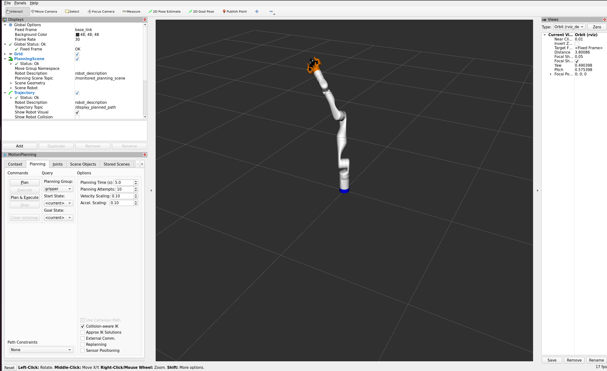
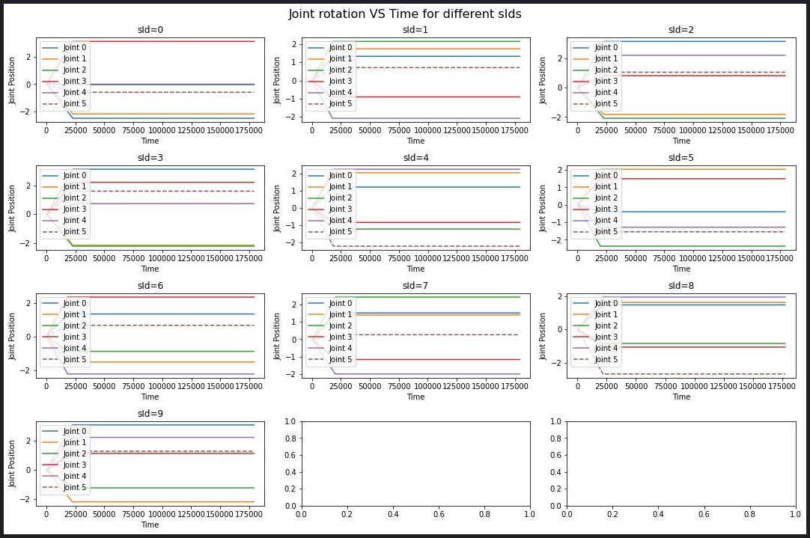

# MoveIT

## Overview
This project is designed to wrap the [MoveIT Robotic Arm Simulation project](https://moveit.picknik.ai/main/doc/tutorials/quickstart_in_rviz/quickstart_in_rviz_tutorial.html) and integrate it with CITROS platform. The node provides ROS 2 parameters that allow users to adjust target arm joints position. In addition, the Inverse Kinematic ROS 2 node was added.



## Prerequisites

1. Please make sure you have all the [necessary softwares](https://citros.io/doc/docs_tutorials/getting_started/#softwares-to-work-with-citros) to work with CITROS installed on your computer.
2. Install [Visual Studio code](https://code.visualstudio.com/download).
3. We strongly recommend that you work with [dockers](https://citros.io/doc/docs_tutorials/dockerfile_overview/). However, if you wish to work without dockers, please refer to the .devcontainer [directory](https://github.com/citros-garden/moveit/tree/main/.devcontainer) in project's repo, the dependencies you need are in the ```Dockerfile``` file.
4. (Optional) Install [Foxglove](https://docs.foxglove.dev/docs/introduction).

## Table of Contents
1. [Installation](#installation)
2. [Workspace Overview](#workspace-overview)
3. [CITROS Initialization](#citros-initialization)
4. [Scenario](#scenario)
5. [Running the Scenario Using CITROS](#running-the-scenario-using-citros)
6. [Results](#results)

## Installation
1. Clone the repository:

    ```bash
    git clone git@github.com:citros-garden/moveit.git
    ```
2. Open the repository in the [VScode Dev Container](../../docs/guides/citros_garden#run-project-in-vscode).
3. [Build the project](../../docs/guides/citros_garden#build-the-project).

## Workspace Overview

The MoveIT simulation has the following ROS 2 parameters:

|Parameter	|Description |Package
|--|--|--
orientation		|Arm orientation 	|moveit_example
pos_x		|Arm position by X axis  	|moveit_example
pos_y		|Arm position by Y axis   |moveit_example
pos_z		|Arm position by Z axis   |moveit_example

This project contains two launch files: 

|Launch File	|Description |Package
|--|--|--
moveit_example.launch.py		|MoveIT launch file with RViz |moveit_example
moveit_example_headless.launch.py	|MoveIT launch file for headless launch |moveit_example


## CITROS Initialization

1. [Install CITROS](../../docs/guides/getting_started#installation).
2. [Initialize CITROS](../../docs/guides/getting_started#initialization).

## Scenario
This scenario is used to show the most useful way to interact with robotic arm using inverse kinematic.
User provides target position and target rotation of arm by three axes as input parameters to configure the simulation. The robotic arm will change its position trying to meet the target conditions. 

In this tutorial, let's check how the robotic arm's behavior changes depending on target position. <br />
For that, we will launch a batch simulation with a random distribution ranging between 0.0 and 0.5, for one of the position parameters  (`pos_z`).
The parameter will be set by a NumPy random function and its  setup is listed in ```.citros/parameter_setups/default_param_setup.json```: <br/>

```json
...
        "moveit_example": {
            "moveit_example": {
                "ros__parameters": {
                    "orientation": 1.0,
                    "pos_x": 0.28,
                    "pos_y": -0.2,
                    "pos_z": {
                        "function": "numpy.random.uniform",
                        "args": [0.0, 0.5]
                    }
                }
            }
        },
...
```

Learn more about parameter setup and defining custom functions in [Directory parameter_setups](../../docs/advanced_guides/citros_structure#directory-parameter_setups) and [Adding Functions to Parameter Setup](../../docs/guides/config_params) pages.

In addition to parameter setup, you can configure the simulation performance setup (timeout, CPU, GPU and Memory) as well.
These parameters can be found in ```.citros/simulations/simulation_moveit_example_headless.json``` for headless launch and in ```.citros/simulations/simulation_moveit_example.json``` for launch with RViz. <br/>
The default setup is 180 seconds timeout, 4 CPU, 4 GPU and 4096 MB of Memory.

Look in [Directory simulations page](../../docs/advanced_guides/citros_structure#directory-simulations) for more information.

## Running the Scenario Using CITROS

Follow these steps to [Run Simulation](../../docs/guides/getting_started#run-simulation):
1. Name your  batch run simulation: `moveit_example`
2. Add a message to your batch run simulation: `test run`
3. Run your simulation ** 10 times **.

All the results will be saved under `.citros/data/simulation_moveit_example_headless/[batch_name]` folder. <br/>
*in this case, batch_name is moveit_example*

To plot the results you can use [Foxglove](../../docs/guides/foxglove_visual) with the layout file existing in `foxglove_layout` folder.


## Results

1. [Create Database](../../docs/guides/getting_started#create-db)
2. [Upload data to the database](../../docs/guides/getting_started#load-data-to-db)
3. [Verify the data was loaded](../../docs/guides/getting_started#verify-data-loaded)
4. [Execute the Notebook](../../docs/guides/getting_started#execute-notebook) `aerosandbox_notebook_example.ipynb`. <br/>
You will find the notebook under `citros_template/notebooks` folder.

You can see the different behavior of the last joint on these plots:


