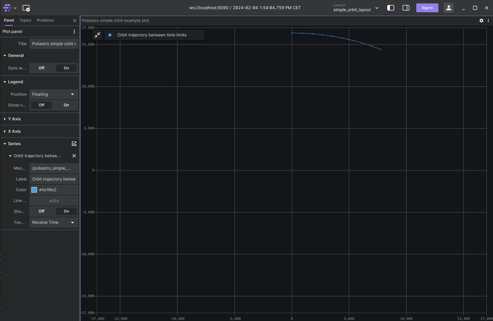
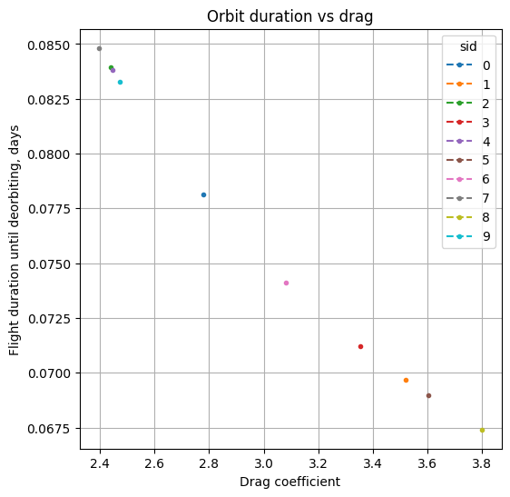

# Poliastro

## Overview
This project contains three simple examples using Poliastro lib for Python3: 
1. Simple orbit example
2. Orbital maneuver example 
3. Atmospheric drag simulation.  

You can find all the information about the used functions and the mathematical explanation on the [Poliastro Website](https://docs.poliastro.space/en/stable/). <br/>
All project installation, code overview and usage details are also available on the project's [GitHub page](https://github.com/citros-garden/poliastro).


## Prerequisites

1. Please make sure you have all the [necessary softwares](../../docs/guides/getting_started#prerequisites-for-working-with-citros) to work with CITROS installed on your computer.
2. Install [Visual Studio code](https://code.visualstudio.com/download).
3. We strongly recommend that you work with [dockers](../../docs/guides/dockerfile_overview). However, if you wish to work without dockers, please refer to the .devcontainer [directory](https://github.com/citros-garden/aerosandbox_cessna/tree/main/.devcontainer) in project's repo, the dependencies you need are in the ```Dockerfile``` file.
4. (Optional) Install [Foxglove](https://docs.Foxglove.dev/docs/introduction).

## Table of Contents
1. [Installation](#installation)
2. [Workspace Overview](#workspace-overview)
3. [CITROS Initialization](#citros-initialization)
4. [Scenario](#scenario)
5. [Running the Scenario Using CITROS](#running-the-scenario-using-citros)
6. [Results](#results)

## Installation
1. Clone the repository:
```bash
git clone git@github.com:citros-garden/poliastro.git
```
2. Open the repository in the [VScode Dev Container](../../docs/guides/getting_started#open-project-in-vscode-dev-container).

## Workspace Overview

The examples have the following parameters:

* Poliastro Atmospheric Drag simulation parameters:

    |Parameter	|Description	|Package
    |--|--|--
    earth_r		|Earth radius	|poliastro_atmo_drag
    a		|Semi-Major axis	|poliastro_atmo_drag
    ecc		|Eccentricity	|poliastro_atmo_drag
    inc		|Inclination	|poliastro_atmo_drag
    raan		|Right Ascension of the Ascending Node	|poliastro_atmo_drag
    argp		|Argument of periapsis	|poliastro_atmo_drag
    nu		|True anomaly	|poliastro_atmo_drag
    c_d		|Drag coefficient	|poliastro_atmo_drag
    t_limit		|Maximum simulation duration	|poliastro_atmo_drag
    publish_freq		|Frequency of publishing |poliastro_atmo_drag 

* Poliastro Simple Orbit simulation parameters:

    |Parameter	|Description	|Package
    |--|--|--
    apo_r		|Apoapsis altitude	|poliastro_simple_orbit
    peri_r		|Periapsis altitude	 |poliastro_simple_orbit
    start_t		|Start date and time	|poliastro_simple_orbit
    finish_t		|Final date and time	|poliastro_simple_orbit
    publish_freq		|Frequency of publishing |poliastro_simple_orbit

* Poliastro Maneuver simulation parameters:

    |Parameter	|Description	|Package
    |--|--|--
    r_init		|Initial orbital altitude	|poliastro_maneuver
    r_final		|Final orbital altitude	|poliastro_maneuver
    publish_freq		|Frequency of publishing |poliastro_maneuver


There are three launch files in this project, these files will be used for CITROS launch:

|Launch File	|Description	|Package
|--|--|--
poliastro_atmo_drag.launch.py		|Poliastro Atmospheric Drag simulation launch file |poliastro_atmo_drag
poliastro_maneuver.launch.py		|Poliastro Simple Orbit simulation launch file |poliastro_maneuver
poliastro_simple_orbit.launch.py		|Poliastro Maneuver simulation launch file |poliastro_simple_orbit


## CITROS Initialization
1. [Install CITROS](../../docs/guides/getting_started#installation).
2. [Initialize CITROS](../../docs/guides/getting_started#initialization).

Now you can see .citros directory in the explorer.

## Scenario
The Poliastro project consists of three packages suitable for orbital mechanics calculations:
* `Poliastro_simple_orbit`<br/>
This package is used to calculate vessel orbital coordinates around the Earth between time bounds from given apoapsis and periapsis altitudes. <br/>
The result is an ephemerids of orbit (actually a part of it between given time bounds) with zero right ascension of the ascending node, argument of the pericenter and true anomaly for simplicity. <br/>
* `Poliastro_maneuver`<br/>
This package calculates three orbits for the Hohmann transition: an initial orbit, an intermediate orbit, and a final orbit. <br/>
The simulation takes the radius of the initial orbit and the radius of the final orbit as input. <br/>
The result is the ephemerids of these orbits, not the trajectory! <br/>
* `Poliastro_atmo_drag`<br/>
This package shows the effect of aerodynamic drag forces on an artificial satellite in low Earth orbit. <br/>
The simulation takes Earth diameter, drag coefficient, Keppler orbit parameters and maximum simulation time as inputs. <br/>
The result is a plot of altitude versus time and flight time before hitting the surface.<br/>

Drag forces calculations are more difficult and more rare than the others, hence, in this tutorial we will use the Atmospheric Drag simulation scenario. <br/>
Let's check how the exact orbit duration reduces depending on Drag coefficient. For that, we will set up Drag Coefficient (```c_d```) parameter random distribution in range from 2 to 4. <br />
The parameter will be set by a NumPy random function and its setup is listed in `.citros/parameter_setups/default_param_setup.json`:

```json
    "packages": {
        "poliastro_atmo_drag": {
            "poliastro_atmo_drag": {
                "ros__parameters": {
                    "earth_r": 6378.1366,
                    "a": 6550.85876692,
                    "ecc": 0.0,
                    "inc": 0.0,
                    "raan": 0.0,
                    "argp": 0.0,
                    "nu": 0.0,
                    "c_d": {
                        "function": "numpy.random.uniform",
                        "args": [2, 4]
                    },
                    "t_limit": 1.0,
                    "publish_freq": 10.0
                }
            }
        },
```

Learn more about parameter setup and defining custom functions in [Directory parameter_setups](../../docs/advanced_guides/citros_structure#directory-simulations) and [Adding Functions to Parameter Setup](../../docs/guides/config_params) pages.

In addition to parameter setup, you can configure the simulation performance setup (timeout, CPU, GPU and Memory) as well.
This parameters can be found in ```.citros/simulations/simulation_poliastro_atmo_drag.json```. <br/>
Look in [Directory simulations page](../../docs/advanced_guides/citros_structure#directory-simulations) for more information.

## Running the Scenario Using CITROS

We will run two simulations of the three exist in the project - `simulation_poliastro_simple_orbit` and `simulation_poliastro_atmo_drag`.

Follow these steps to [Run Simulation](../../docs/guides/getting_started#run-simulation)

run the simulation with the following details:
1. Name your batch run simulation: `poliastro_simple_orbit`
2. Add a message to your batch run simulation: `simple orbit run`
3. Run your simulation ** 10 times **.
4. choose the `simulation_poliastro_simple_orbit` simulation

All the results will be saved under `.citros/data/simulation_poliastro_simple_orbit` folder.<br/>
*in this case, batch_name is poliastro_simple_orbit*


After the above will run, go a head and run another simulation with the following details:
1. Name your batch run simulation: `poliastro_atmo_drag`
2. Add a message to your batch run simulation: `atmo drag run`
3. Run your simulation ** 10 times **.
4. choose the `simulation_poliastro_atmo_drag` simulation

All the results will be saved under `.citros/data/simulation_poliastro_atmo_drag/[batch_name]` folder.<br/>
*in this case, batch_name is poliastro_atmo_drag*


To plot the local run results you can use [Foxglove](../../docs/guides/foxglove_visual) with the `atmo_drag_layout.json` layout file existing in `foxglove_layout` folder.




## Results

1. [Create Database](../../docs/guides/getting_started#create-db)
2. [Upload data to the database](../../docs/guides/getting_started#load-data-to-db)<br/>
*Don't forget uploading both simulation*
3. [Verify the data was loaded](../../docs/guides/getting_started#verify-data-loaded)
4. [Execute the Notebook](../../docs/guides/getting_started#execute-notebook) `pliastro_notebook_example.ipynb`. <br/>
You will find the notebook under `citros_template/notebooks` folder.

The graph below shows us the exact orbit duration depending of Drag coefficient:



