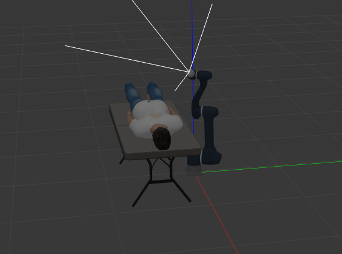
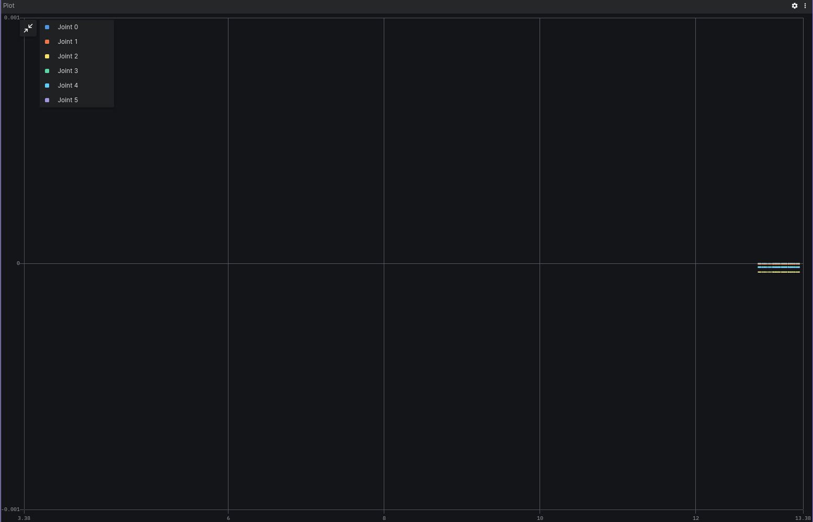
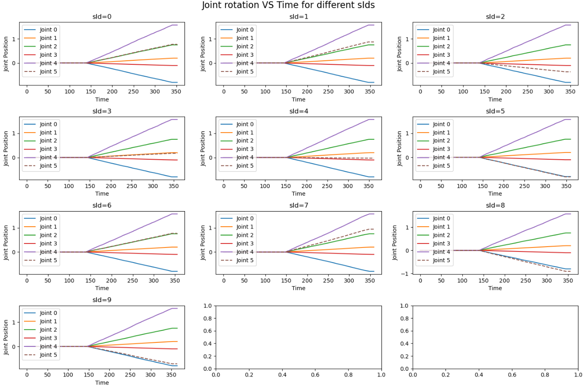

# Robotic Arm

## Overview
This project is designed to wrap the [Robotic Arm Simulation project](https://github.com/dvalenciar/robotic_arm_environment) and integrate it with CITROS platform. The node provides ROS 2 parameters that allow users to adjust target arm joints position. In addition, the Inverse Kinematic ROS 2 node was added.



## Prerequisites

1. Please make sure you have all the [necessary softwares](../../docs/guides/getting_started#prerequisites-for-working-with-citros) to work with CITROS installed on your computer.
2. Install [Visual Studio code](https://code.visualstudio.com/download).
3. We strongly recommend that you work with [dockers](../../docs/guides/dockerfile_overview). However, if you wish to work without dockers, please refer to the .devcontainer [directory](https://github.com/citros-garden/aerosandbox_cessna/tree/main/.devcontainer) in project's repo, the dependencies you need are in the ```Dockerfile``` file.
4. (Optional) Install [Foxglove](https://docs.Foxglove.dev/docs/introduction).

## Table of Contents
1. [Installation](#installation)
2. [Workspace Overview](#workspace-overview)
3. [CITROS Initialization](#citros-initialization)
4. [Scenario](#scenario)
5. [Running the Scenario Using CITROS](#running-the-scenario-using-citros)
6. [Results](#results)

## Installation
1. Clone the repository:

    ```bash
    git clone git@github.com:citros-garden/robotic_arm.git
    ````````
2. Open the repository in the [VScode Dev Container](../../docs/guides/citros_garden#run-project-in-vscode).
3. [Build the project](../../docs/guides/citros_garden#build-the-project).

## Workspace Overview

The Robotic Arm simulation has the following ROS 2 parameters:

* Forward Kinematic simulation parameters:

    |Parameter	|Description |Package
    |--|--|--
    j0		|First joint target position 	|my_doosan_pkg
    j1		|Second joint target position  	|my_doosan_pkg
    j2		|Third joint target position  |my_doosan_pkg
    j3		|Fourth joint target position  |my_doosan_pkg
    j4		|Fifth joint target position  |my_doosan_pkg
    j5		|Sixth joint target position  |my_doosan_pkg

* Inverse Kinematic simulation parameters:

    |Parameter	|Description |Package
    |--|--|--
    pos0		|Arm target position by first axis	|inverse_kinematic_pkg
    pos1		|Arm target position by second axis |inverse_kinematic_pkg
    pos2		|Arm target position by third axis |inverse_kinematic_pkg
    ori0		|Arm target orientation by first axis |inverse_kinematic_pkg
    ori1		|Arm target orientation by second axis  |inverse_kinematic_pkg
    ori3		|Arm target orientation by third axis |inverse_kinematic_pkg


This project contains two launch files: 

|Launch File	|Description |Package
|--|--|--
my_doosan_gazebo_controller.launch.py		|Gazebo Robotic Arm launch file for Forward Kinematic |my_doosan_pkg
simulation_inverse_kinematic_pkg.launch.py	|Gazebo Robotic Arm launch file for Inverse Kinematic |inverse_kinematic_pkg


## CITROS Initialization

1. [Install CITROS](../../docs/guides/getting_started#installation).
2. [Initialize CITROS](../../docs/guides/getting_started#initialization).

## Scenario
* Inverse kinematics <br/>
    The Inverse Kinematic calculations are used to show more useful way to interact with robotic arm.  <br/>
    User provides target position and target rotation of arm by three axes as input parameters to configure the simulation. The robotic arm will change its position trying to meet the target conditions. 

* Forward kinematics <br/>
    Forward Kinematic calculation is the simplest way to control the robotic arm behavior. <br/> 
    User provides joints target positions as input parameters to configure the simulation. The robotic arm will change its position trying to meet the target conditions, and the simulation publishes the current positions of joints as a result.<br/>
    
    In this tutorial, let's check how the robotic arm's behavior changes depending on target position. <br />
    For that, we will launch a batch simulation with a random distribution ranging between 0.0 and 0.5, for the last joint position parameter  (`j5`).
    The parameter will be set by a NumPy random function and its  setup is listed in ```.citros/parameter_setups/default_param_setup.json```: <br/>

```json
{
    "packages": {
        "my_doosan_pkg": {
            "trajectory_points_act_server": {
                "ros__parameters": {
                    "j0": -0.8,
                    "j1": 0.2,
                    "j2": 0.75,
                    "j3": -0.102,
                    "j4": 1.57,
                    "j5": {
                        "function": "numpy.random.uniform",
                        "args": [0.0, 0.5]
                    }
                }
            }
        }
    }
}
```

Learn more about parameter setup and defining custom functions in [Directory parameter_setups](../../docs/advanced_guides/citros_structure#directory-parameter_setups) and [Adding Functions to Parameter Setup](../../docs/guides/config_params) pages.

In addition to parameter setup, you can configure the simulation performance setup (timeout, CPU, GPU and Memory) as well.
These parameters can be found in ```.citros/simulations/simulation_my_doosan_gazebo_controller.json``` for Forward Kinematic or ```.citros/simulations/simulation_inverse_kinematic_pkg.json``` for Inverse Kinematic. <br/>
Look in [Directory simulations page](../../docs/advanced_guides/citros_structure#directory-simulations) for more information.

## Running the Scenario Using CITROS

Follow these steps to [Run Simulation](../../docs/guides/getting_started#run-simulation):
1. Name your  batch run simulation: `robotic_arm`
2. Add a message to your batch run simulation: `local test run`
3. Run your simulation ** 10 times **.
4. choose the `simulation_my_doosan_gazebo_controller` simulation
All the results will be saved under `.citros/data/simulation_robotic_arm_cessna` folder.
*in this case, batch_name is robotic_arm*

To plot the results you can use [Foxglove](../../docs/guides/foxglove_visual) with the layout file existing in `foxglove_layout` folder.



## Results

1. [Create Database](../../docs/guides/getting_started#create-db)
2. [Upload data to the database](../../docs/guides/getting_started#load-data-to-db)
3. [Verify the data was loaded](../../docs/guides/getting_started#verify-data-loaded)
4. [Execute the Notebook](../../docs/guides/getting_started#execute-notebook) `robotic_arm_notebook_example.ipynb`. <br/>
You will find the notebook under `citros_template/notebooks` folder.

You can see the different behavior of the last joint on these plots:

