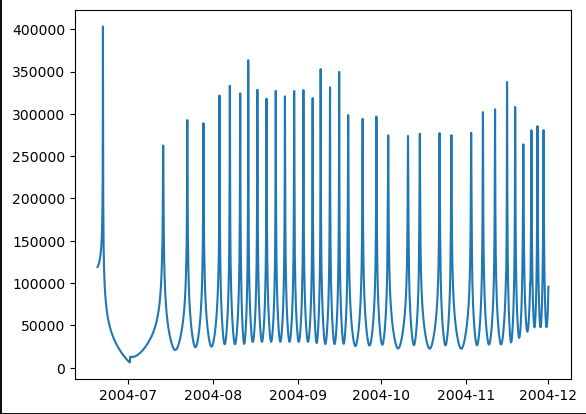

# SpiceyPy

## Overview
This project is developed using ROS 2 nodes and leverages the SpiceyPy library - a Python implementation of [NASA's NAIF Spice](https://naif.jpl.nasa.gov/naif/) toolkit. Its primary purpose is to provide the orbital trajectory information of the Cassini spacecraft relative to Saturn's barycenter within specified time intervals.

You can find more information about SpiceyPy library on [SpiceyPy official website](https://spiceypy.readthedocs.io/en/v2.0.0/index.html). <br />
All project installation, code overview and usage details are also available on the project's [GitHub page](https://github.com/citros-garden/spiceypy).


## Prerequisites

1. Please make sure you have all the [necessary softwares](../../docs/guides/getting_started#prerequisites-for-working-with-citros) to work with CITROS installed on your computer.
2. Install [Visual Studio code](https://code.visualstudio.com/download).
3. We strongly recommend that you work with [dockers](../../docs/guides/dockerfile_overview). However, if you wish to work without dockers, please refer to the .devcontainer [directory](https://github.com/citros-garden/aerosandbox_cessna/tree/main/.devcontainer) in project's repo, the dependencies you need are in the ```Dockerfile``` file.

## Table of Contents
1. [Installation](#installation)
2. [Workspace Overview](#workspace-overview)
3. [CITROS Initialization](#citros-initialization)
4. [Scenario](#scenario)
5. [Running the Scenario Using CITROS](#running-the-scenario-using-citros)
6. [Results](#results)

## Installation
1. Clone the repository:

    ```bash
    git clone git@github.com:citros-garden/spiceypy.git
    ```

2. Open the repository in the [VScode Dev Container](../../docs/guides/citros_garden#run-project-in-vscode).
3. [Build the project](../../docs/guides/citros_garden#build-the-project).

## Workspace Overview

The SpiceyPy simulation has the following ROS 2 parameters:

|Parameter	|Description	|Package
|--|--|--
start_t		|Initial date	|spiceypy_cassini
finish_t		|Final date	 |spiceypy_cassini
publish_freq		|Frequency of publishing |spiceypy_cassini


This project contains only one launch file which will be used for CITROS launch. 

|Launch File	|Description	|Package
|--|--|--
spiceypy_cassini.launch.py		|SpiceyPy Cassini simulation launch file 	|spiceypy_cassini

## CITROS Initialization

1. [Install CITROS](../../docs/guides/getting_started#installation).
2. [Initialize CITROS](../../docs/guides/getting_started#initialization).

## Scenario
This simple scenario can be used to find the Cassini Spacecraft trajectory relative to Saturn's barycenter within specified time intervals. <br/>
Users can input the desired time bounds, and the output of the simulation will contain critical flight data, such as altitude, velocity, and other relevant parameters, recorded over time intervals. <br/>
This tutorial is used to show the CITROS ability to implement any useful library, in this case, the popular SpiceyPy NASA lib for spacecraft tracking. The project's setup is also showing how user can save all the simulation results in one place for any number of simulations and share these results with coworkers. <br/>
The parameter setup is listed in ```.citros/parameter_setups/default_param_setup.json```:
```json
{
    "packages": {
        "spiceypy_cassini": {
            "spiceypy_cassini": {
                "ros__parameters": {
                    "start_t": "Jun 20, 2004",
                    "finish_t": "Dec 1, 2006",
                    "num_steps": 4000,
                    "publish_freq": 100.0
                }
            }
        }
    }
}
```

Learn more about parameter setup and defining custom functions in [Directory parameter_setups](../../docs/advanced_guides/citros_structure#directory-parameter_setups) and [Adding Functions to Parameter Setup](../../docs/guides/config_params) pages.

In addition to parameter setup, you can configure the simulation performance setup (timeout, CPU, GPU and Memory) as well.
This parameters can be found in ```.citros/simulations/simulation_spiceypy_cassini.json```. <br/>
Look in [Directory simulations page](../../docs/advanced_guides/citros_structure#directory-simulations) for more information.

## Running the Scenario Using CITROS

Follow these steps to [Run Simulation](../../docs/guides/getting_started#run-simulation):
1. Name your  batch run simulation: `spiceypy_cassini`
2. Add a message to your batch run simulation: `test run`
3. Run your simulation ** 10 times **.

All the results will be saved under `.citros/data/simulation_spiceypy_cessna/[batch_name]` folder. <br/>
*in this case, batch_name is spiceypy_cassini*


## Results

1. [Create Database](../../docs/guides/getting_started#create-db)
2. [Upload data to the database](../../docs/guides/getting_started#load-data-to-db)
3. [Verify the data was loaded](../../docs/guides/getting_started#verify-data-loaded)
4. [Execute the Notebook](../../docs/guides/getting_started#execute-notebook) `SpiceyPy Notebook.ipynb`. <br/>
You will find the notebook under `citros_template/notebooks` folder.

The graph below shows us the Cassini altitude:

