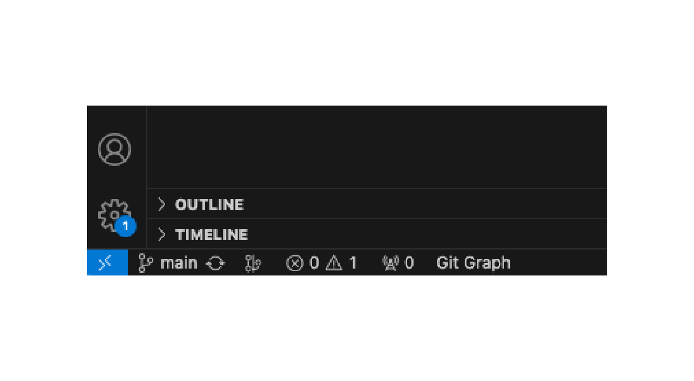

# CITROS Garden Project

[CITROS Garden](https://github.com/citros-garden) is an open-source organization holds different projects to explore CITROS abilities. <br />
All the projects can be found [here](https://github.com/orgs/citros-garden/repositories)

## Clone CITROS Garden Project

To clone the repository:
 ```sh
 git clone git@github.com:citros-garden/repository_name.git
   ```

## Run Project in VScode
1. Open the cloned repository in VScode:

 ```sh
 cd ~/project-name
 code .
 ```

## Open Project in VScode Dev Container

We strongly recommend that you work with [dockers](../guides/dockerfile_overview). <br/>
However, if you wish to work without dockers, please refer to the .devcontainer in project's repository, the dependencies you need are in the `Dockerfile` file.

1. Open and run Docker.
2. Press on the bottom left corner icon.

3. Choose **Reopen in Container**

4. Open VScode terminal and make sure you are in the right location. <br />
 
 ```    
 ros@docker-desktop:/workspaces/[Project Name]$
 ```
5. [Build the project](#build-the-project)

## Build the project

 ```bash
 $ colcon build
 $ source install/local_setup.bash
 ```

