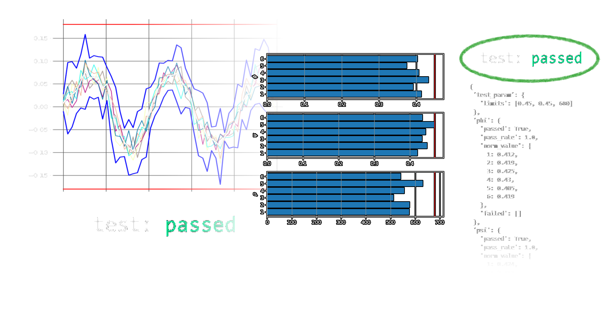

# Overview

The third part of the **citros** package provides methods to tests the results of the simulations. Taking into consideration various simulations, you can establish correspondence between their results, compute statistics, and verify if, for example, the mean values or standard deviations fall within the specified limits. All these tasks can be efficiently accomplished in minimal steps using the **validation** module. To learn more, check the [examples](getting_started.md), [documentation](../documentation/validation/validation.md) and [snippets](../snippets_doc/snippets_validation.md).

