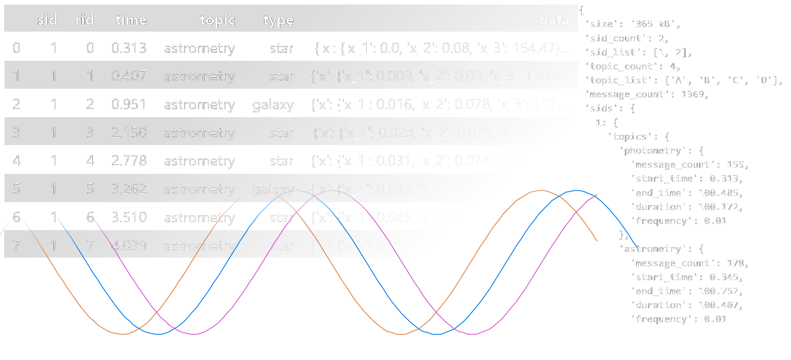

# Overview

The following part of the **citros** package is designed to communicate with the database and obtain information about the selected data. 
You will be able to effortlessly get overview about the simulated data and its structure, create queries and download the data you are interested in. Once you have your data, the package provides set of tools for data visualization and manipulation, making it easy to prepare your data for future analysis. See the [examples](getting_started.md) of its main features, [documentation](../documentation/access/citros_db.md) of the main classes and [snippets](../snippets_doc/data_access/snippets_batch_content.md).

