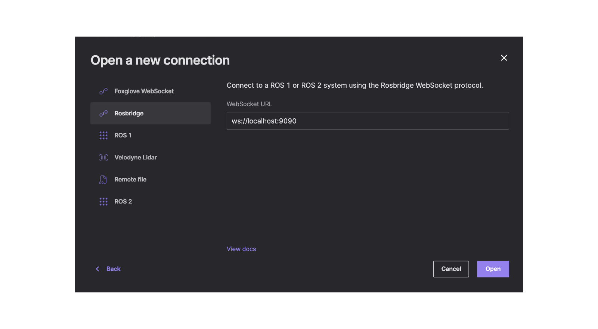

---

sidebar_label: 'Visualize with Foxglove'
hide_title: true
---

# Visualize with Foxglove

Foxglove helps to view a graphical representation of the simulation.

1. Download and install [Foxglove](https://foxglove.dev/download)
2. Open Foxglove
3. Press on Foxglove icon at the top right
4. Click View
5. Click "Import layout from file"

 

6. Choose the `[layout_name].json` from the project directory.

7. Open a new Connection.

 

8. Choose Rosbridge and press the 'Open' button
 
 

9. You now have a working connection to your simulation, you can now run the simulation and check the output in Foxglove.

Output example:
